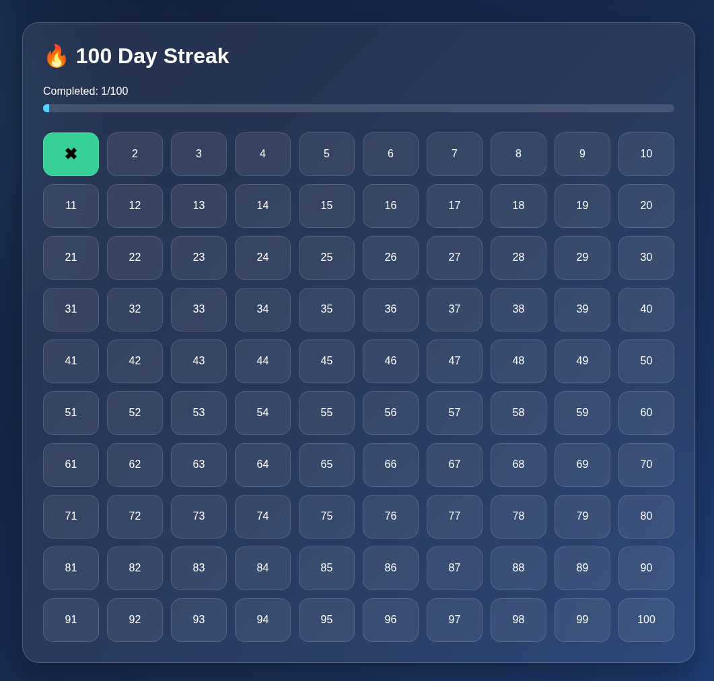

# 🔥 100 Day Streak Tracker

A modern and lightweight streak tracker designed to help you stay consistent with your daily goals for 100 days.

Built using **HTML**, **CSS**, and **Vanilla JavaScript**, the application stores your progress locally, so your streak remains saved even after closing the browser.

---

## ✨ Features

* ✅ Track your progress for 100 days
* ❌ One-click daily check/uncheck
* 💾 Progress saved using Local Storage
* 📊 Live progress bar
* 📅 Highlights the current day
* 💎 Modern Glassmorphism UI
* 📱 Responsive Grid Layout
* ⚡ No frameworks or libraries

---

## 🛠️ Technologies Used

* HTML5
* CSS3
* JavaScript (ES6)
* Local Storage API

---

## 📸 Preview



---

## 🚀 Getting Started

Clone the repository:

```bash
git clone https://github.com/your-username/100-day-streak-tracker.git
```

Open the project folder and launch `index.html` in your browser.

---

## 🌐 Live Demo

Enable GitHub Pages and add the project URL here.

---

## 📂 Project Structure

```text
├── index.html
├── style.css
├── script.js
└── README.md
```

---

## 🎯 Future Improvements

* Dark / Light mode
* GitHub-style heatmap
* Achievement badges
* Weekly & monthly analytics
* Data export/import
* PWA support
* Motivational quotes
* Custom challenge duration

---

## 📄 License

This project is licensed under the MIT License.
